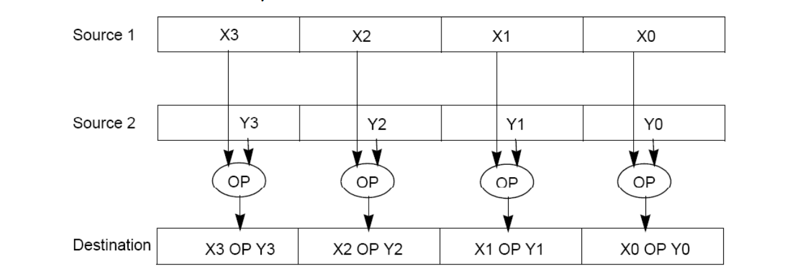
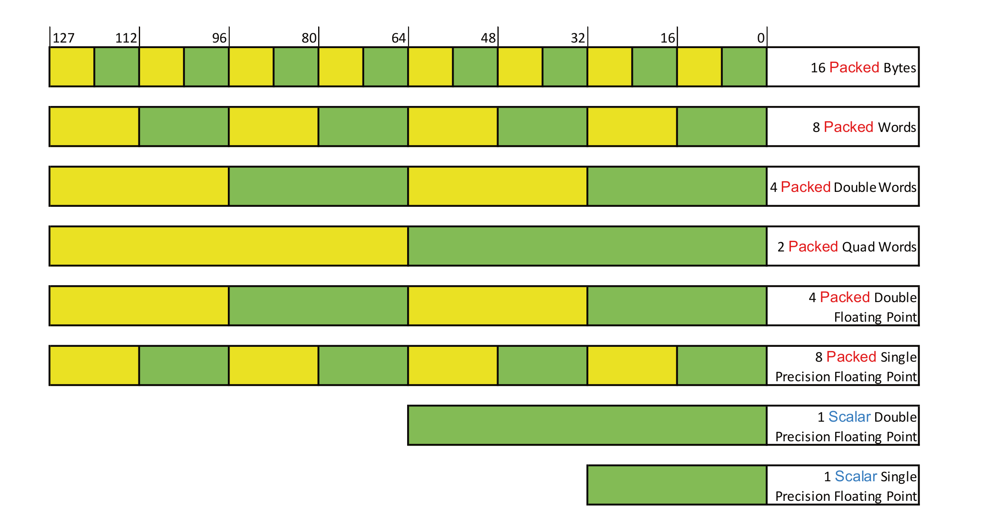
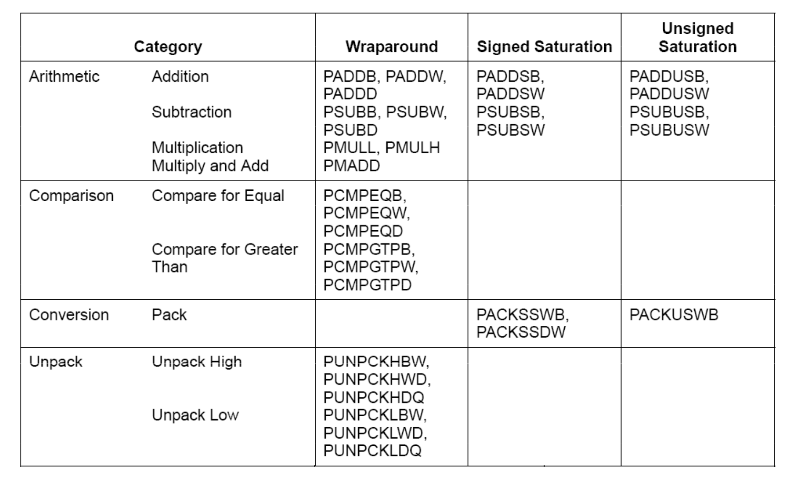
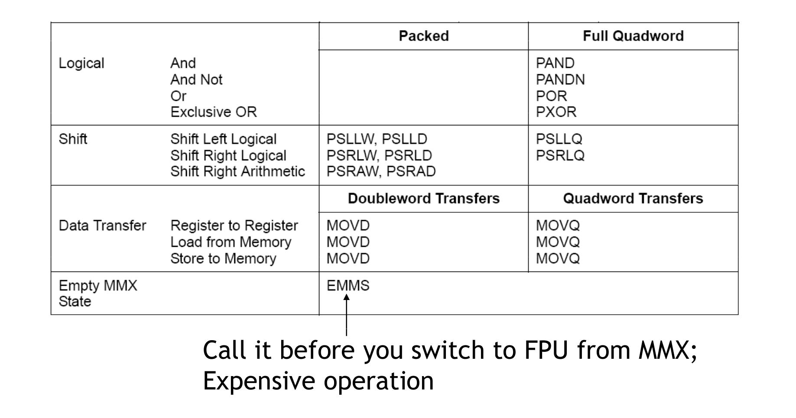
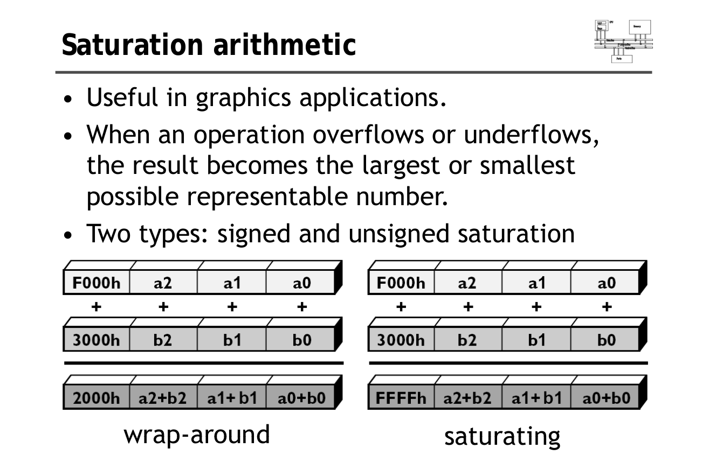
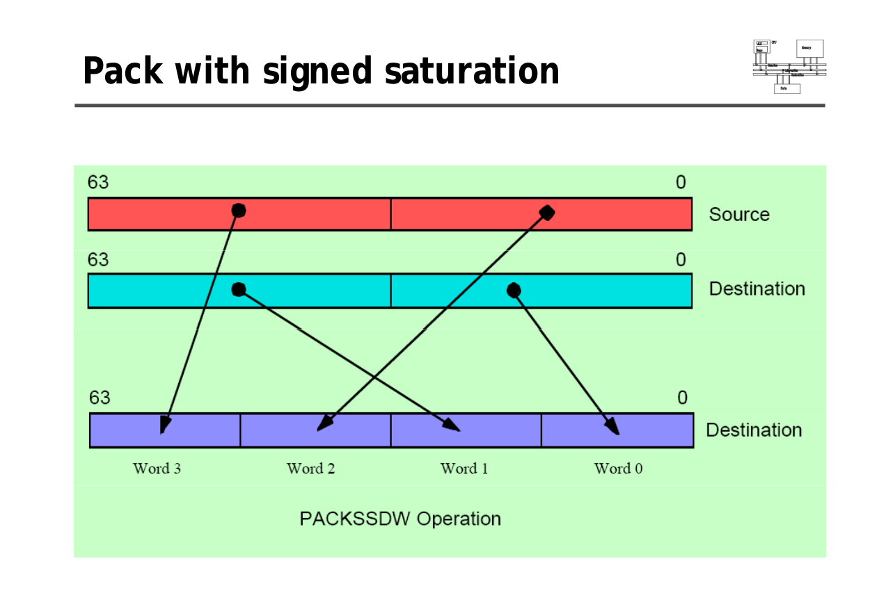
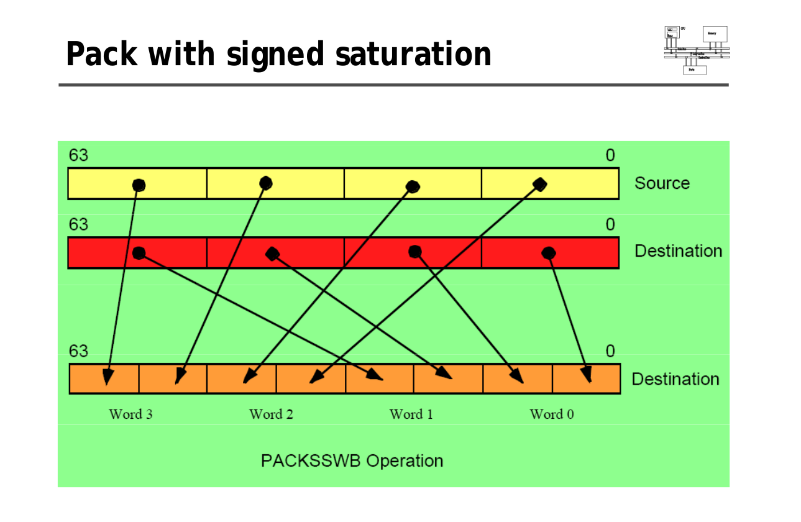

## A notebook to learn Assembly Language
---

### Main internal hardware of a PC consists:

1. Processor,
2. Memory,
3. Registers


### Data Sizes:
 - byte: 8 bit
 - word: 16 bit
 - doubleword: 32 bit
 - quadword: 64 bit
 - paragraph: 128 bit


### Addressing Data in Memory:

 - Fetch the instruction from memory
 - Decoding or identifying the instruction
 - Executing the instruction
 
N.B: Processor may access one or more bytes of memory at a time. 

Let A = 0x07F5 which needs 2 byte -> 64 bit
 - 0 -> 16 bit
 - 7 -> 16 bit
 - F -> 16 bit
 - 5 -> 16 bit

### List of popular Assembler to run assembly code:

 - MASM (Microsoft Assembler)
 - TASM (Borland Turbo Assembler)
 - GAS (The GNU assembler)
 - NASM (Netwide Assembler) 
 - FASM
 - YASM
 
 ### Build and Run an Assembly Code:
 
  - Compile asm file: <b>nasm -f elf hello.asm</b>
  - Create Executable file:	<b>ld -m elf_i386 -s -o hello hello.o</b>
  - Finally Run executable:	<b>./hello</b>
 
   
                             
### Assembly Program divided into 3 sections:

 - data section : section.data
 - bss section : section.bss
 - text section : section.text
 	
### Comments:
 ```assembly 
 ; this program displays a message on screen
 ```


### Statements are 3 types:
  - executable instructions
  - assembler directives or pseudo-ops
  - macros
  
```assembly
 [label] mnemonic [operands] [;comment]
 
 INC COUNT 		; Increment the memory variable COUNT
 MOV TOTAL, 48		; Transfer the value 48 in the memory variable TOTAL
 ADD AH, BH		; Add the content of the BH register into the AH register
 AND MASK1, 128		; Perform AND operation on the variable MASK1 and 128
 ADD MARKS, 10 		; Add 10 to the variable MARKS
 MOV AL, 10		; Transfer the value 10 to the AL register
 ```
 
 
 ### Processor Registers:
 - General Purpose Registers(GPR):
 	- 16 GPRs on the x64 instruction set
  	- names: rax, rbx, rcx, rdx, rbp, rsi, rdi, rsp, r8, r9, r10, r11 r12, r13, r14 and r15.
  	- let's try to visualize how first 8 registers are addressed a little better.
 		
  	- let's try to visualize how r8-r15 registers are addressed.
 		
  	- here b, w, d means byte, word and doubleword respectively.
 - Floating Point Registers:
  	- 16 floating point registers, known as the xmm registers (xmm0 - xmm15).
	- each register 128-bit wide
	- Generally used for SIMD (Single Instruction Multiple Data) operations
	- lower bits cannot be addressed separately
 - Extensions: SSE/AVX/AVX2/AVX512:
	- SSE: Streaming SIMD Extensions
	- AVX: Advanced Vector Extensions
	- 1999 intel introduced much wider registers upto 512-bit
		
 - Special purpose registers:
	- rip: (Instruction Pointer) holds the address of where the next instruction to be executed is at in the assembly. 
	- rsp: (Stack Pointer) meant to point to the bottom of the program stack
	- rbp: (Base Pointer) helps in referencing the parameter variables passed to a subroutine.
 - Index registers:
	- rsi: source index
	- rdi: destination index
 - Control registers:
  	- 32 bit instruction pointer register and 32 bit flags register combined are considered as the control register.
  	- OF: (Overflow Flag) -> indicates the overflow of a high order bit of data after a signed arithmetic operation
  	- DF: (Direction Flag) -> determines left or right direction for moving or comparing string data.
		- DF = 0 --> the string operation takes left-to-right direction
		- DF = 1 --> the string operation takes right-to-left direction
  	- IF: (Interrupt Flag) -> determines whether the external interrupts (i.e. keyboard entry) are to be processed
	- TF: (Trap Flag) -> set the operation of the processor in single step mode.
  	- SF: (Sign Flag) -> shows thesign of the result of an arithmatic operation. 
  	- ZF: (Zero Flag) -> indicates the result of an arithmetic or compariosn operation. A non zero result clears the zero flag to 0, and a zero results sets it to 1
  	- AF: (Auxiliary Cary Flag) ->  contains the carry from bit 3 to 4 following an arithmetic operation.
  	- PF: (Parity Flag) -> Indicates the total number of bits in the result obtained from an arithmetic operation.
  	- CF: (Carry Flat) -> It contains the carry of 0 or 1 from a higher order bit  after an arithmetic operation.
 
  	
### Some Common System Calls:
 
	%eax	        Name		%ebx		%ecx		%edx			%esx		%edi
	1		sys_exit	int		-		-			-		-
	2		sys_fork	struct pt_regs	-		-			-		-
	3		sys_read	unsigned int	char *		size_t			-		-
	4		sys_write	unsigned int	const char *	size_t			-		-
	5		sys_open	const char *	int		int			-		-
	6		sys_close	unsigned int	-		-			-		-
  	 			
  	
  	
  
  
 
 ### Addressing Modes:
 	- Regiser addressing
 	- Immediate addressing
 	- Memory addressing
 	
 
 ### Initialize data:
 
	choice		DB	'y'
	number		DW	12345
	neg_number	DW	-12345
	big_number	DQ	123456789
	real_number1	DD	1.234
	real_number2	DQ	123.456
	
	marks  TIMES  9  DW  0  	; marks = [0, 0, 0, 0, 0, 0, 0, 0, 0] each value is defiend as Word (16 bits)
	
	
### Allocate storage space for Uninitialized data:


	RESB  	; Reserve a Byte
	RESW  	; Reserve a Word
	RESD  	; Reserve a Doubleword
	RESQ  	; Reserve a Quadword
	REST  	; Reserve a Ten Bytes


### The EQU Directive:

	CONSTANT_NAME EQU expression
	
	
	Examples:
		TOTAL_STUDENTS equ 50
		LENGTH equ 20
		WIDTH  equ 10
		AREA   equ length * width
		


	
### Arithmetic Instruction sets:

```assembly
INC destination
DEC destination
	Examples:
		INC ebx 	; Increments 32-bit register
		INC DL		; Increments 8-bit register
		INC [count]	; Increments the count variable


ADD destination, source
SUB destination, source

MUL multiplier
IMUL multiplier

DIV divisor
IDIV divisor
```
  
### Logical Instruction sets:

```assembly
AND operand1, operand2
OR operand1, operand2
XOR operand1, operand2
TEST operand1, operand2
NOT operand1
```

### Conditions:
```assembly
CMP DX,	00  ; Compare the DX value with zero
JE  L7      ; Jump if equal, to label L7
.
.
L7: ...  

INC	EDX
CMP	EDX, 10	; Compares whether the counter has reached 10
JLE	LP1     ; Jump if less than or equal to 10,  to label LP1
.
.
LP1: ...

JMP LP2		; Jump unconditionally to label LP2
.
.
LP2: ...
```

### Loops:
- ECX register contains the loop count
- JMP instruction can be used for implementing loops
- Following code snippet execute loop for 10 times

```assembly
MOV	CL, 10
L1:
DEC	CL			; decrement CL by 1
JNZ	L1			; Jump if not zero, to label L1


; Following implementation does the same thing using LOOP instruction
MOV	ECX, 10
L1:
DEC	ECX
LOOP L1
```

### Numbers:
 - represented in binary system
 - arithmetic instructions operate on binary data
 - while displaying to screen they are converted to ASCII form

[Todo: I have a feeling that currently this topic is not that important to know in detail. I will be mostly busy with processing strings. I will comeback with this topic later]

### Strings:
- Let's deeply understand following code snippet
```assembly
msg  db  'Hello, world!',0xa ;our dear string
len  equ  $ - msg            ;length of our dear string
```
- <b>msg</b>, <b>len</b> are two variables with custom name
- <b>$-msg</b> : gives the length of the string stored in <b>msg</b>.
- <b>0xa</b>: a sentinel character indicates the ending of a string. 

Facts:
 - string instructions use ESI and EDI registers to point to the source and destination operands.
 - 5 basic instructions for processing strings
	- MOVS : moves 1 byte, word or doubleword of data from memory location to another.
	- LODS: loads from memory. if operand is of one byte, it is loaded into the AL register, if the operand is one word, it is loaded into the AX register and a doubleword is loaded into the EAX register.
	- STOS: stores the data from register (AL, AX or EAX) to memory
	- CMPS: compares two data items in memory. Data could be of a byte size, word or doubleword.
	- SCAS: compares the contents of a register (AL, AX or EAX) with the contents of an item in memory
- instructions use the ES:DI and DS:DI pair of registers, where DI and SI registers contain valid offset addresses that refers to bytes stored in memory. 


 ### Arrays:
 - data definition directives can be used for defining a one-dimentional array.
```assembly
; Initialize an array with multiple numbers, each number is 2 byte
NUMBERS	DW  34,  45,  56,  67,  75, 89

; Initialize an array with all zeros
INVENTORY   DW  0, 0 , 0 , 0 , 0 , 0 , 0 , 0
;or 
INVENTORY TIMES 8 DW 0
```

### Procedures/Subroutines:
```assembly
section	.text
   global _start        ;must be declared for using gcc
	
_start:	                ;tell linker entry point
   mov	ecx,'4'
   sub     ecx, '0'
	
   mov 	edx, '5'
   sub     edx, '0'
	
   call    sum          ;call sum procedure
   mov 	[res], eax
   mov	ecx, msg	
   mov	edx, len
   mov	ebx,1	        ;file descriptor (stdout)
   mov	eax,4	        ;system call number (sys_write)
   int	0x80	        ;call kernel
	
   mov	ecx, res
   mov	edx, 1
   mov	ebx, 1	        ;file descriptor (stdout)
   mov	eax, 4	        ;system call number (sys_write)
   int	0x80	        ;call kernel
	
   mov	eax,1	        ;system call number (sys_exit)
   int	0x80	        ;call kernel
sum:
   mov     eax, ecx
   add     eax, edx
   add     eax, '0'
   ret
	
section .data
msg db "The sum is:", 0xA,0xD 
len equ $- msg   

segment .bss
res resb 1
```
 -  simple procedure named sum that adds the variables stored in the ECX and EDX register and returns the sum in the EAX register
---

### Function
 - Here is a simple c function that can be considered
```c++
unsigned int getsum_x86_64(unsigned int &a, unsigned int &b);
```

 - Assembly implementation will look like following
 ```assembly
 section .text
global getsum_x86_64    ; parameters are in rcx and rdx
getsum_x86_64:
    mov rax, [rcx]  	; store value of rcx into rax
    add rax, [rdx]  	; add value of rdx with rax
	ret
 ```

### File management
[Todo: I will explore this topic later if I really need to]

### Memory management
[Todo: I will explore this topic later if I really need to]

### SIMD Instruction Sets (Most Interesting and Advanced topic)
 - Single Instruction Multiple Data
 - to perform one operation across multiple streams of data at once in order to reduce the amount of work done.
 - A proper visualization would be like following
	
 - MMX (Multimedia Extension) was introduced in 1996 
 - Many multimedia algorithms execute the same instructions on many pieces of  data in a large data set. For example:
	- MPEG data operations
	- Music data
	- Image processing
	- Gaming data
	- Audio/Video codec optimizations
 - Typical elements are small. i.e. 8 bits for pixels, 16 bits for audio, 32 bits  or graphics and general computing.
 - MMX data types are following:
	
 - In total <b>57 MMX</b> instructions are defined to perform the parallel operations on multiple data elements packed into 64-bit data types including:
	- add
	- subtract
	- multiply
	- compare
	- shift
	- data conversion
	- 64-bit data move
	- 64-bit logical operations
	- multiply-add
 - Following 2 charts will give a brief overview of all SIMD instruction sets
 	
	
 - If we look at the chart, one thing we might be interested to know the difference between wrap-around and  Saturation.
	
 - PADDB/PADDW/PADDD: add two packed numbers i.e byte/word/doubleword
 - PMULLW: multiply 4 words and stores the four lo words of the four double word results
 - PMULHW/PMULHUW: multiply four words and stores the four hi words of the four doubleword results. PMULHUW is used for unsigned word.
 - PACKSSWB/PACKSSDW: Pack with Signed Saturation instruction works exactly as following implementation.
	```c++
	switch(Instruction) 
	{
		case PACKSSWB:
			if(OperandSize == 64) {
				//PACKSSWB instruction with 64-bit operands
				Destination[0..7] = SaturateSignedWordToSignedByte(Destination[0..15]);
				Destination[8..15] = SaturateSignedWordToSignedByte(Destination[16..31]);
				Destination[16..23] = SaturateSignedWordToSignedByte(Destination[32..47]);
				Destination[24..31] = SaturateSignedWordToSignedByte(Destination[48..63]);
				Destination[32..39] = SaturateSignedWordToSignedByte(Source[0..15]);
				Destination[40..47] = SaturateSignedWordToSignedByte(Source[16..31]);
				Destination[48..55] = SaturateSignedWordToSignedByte(Source[32..47]);
				Destination[56..63] = SaturateSignedWordToSignedByte(Source[48..63]);
			}
			else {
				//PACKSSWB instruction with 128-bit operands
				Destination[0..7] = SaturateSignedWordToSignedByte(Destination[0..15]);
				Destination[8..15] = SaturateSignedWordToSignedByte(Destination[16..31]);
				Destination[16..23] = SaturateSignedWordToSignedByte(Destination[32..47]);
				Destination[24..31] = SaturateSignedWordToSignedByte(Destination[48..63]);
				Destination[32..39] = SaturateSignedWordToSignedByte(Destination[64..79]);
				Destination[40..47] = SaturateSignedWordToSignedByte(Destination[80..95]);
				Destination[48..55] = SaturateSignedWordToSignedByte(Destination[96..111]);
				Destination[56..63] = SaturateSignedWordToSignedByte(Destination[112..127]);
				Destination[64..71] = SaturateSignedWordToSignedByte(Source[0..15]);
				Destination[72..79] = SaturateSignedWordToSignedByte(Source[16..31]);
				Destination[80..87] = SaturateSignedWordToSignedByte(Source[32..47]);
				Destination[88..95] = SaturateSignedWordToSignedByte(Source[48..63]);
				Destination[96..103] = SaturateSignedWordToSignedByte(Source[64..79]);
				Destination[104..111] = SaturateSignedWordToSignedByte(Source[80..95]);
				Destination[112..119] = SaturateSignedWordToSignedByte(Source[96..111]);
				Destination[120..127] = SaturateSignedWordToSignedByte(Source[112..127]);
			}
			break;
		case PACKSSDW:
			if(OperandSize == 64) {
				//PACKSSDW instruction with 64-bit operands
				Destination[0..15] = SaturateSignedDoublewordToSignedWord(Destination[0..31]);
				Destination[16..31] = SaturateSignedDoublewordToSignedWord(Destination[32..63]);
				Destination[32..47] = SaturateSignedDoublewordToSignedWord(Source[0..31]);
				Destination[48..63] = SaturateSignedDoublewordToSignedWord(Source[32..63]);
			}
			else {
				//PACKSSDW instruction with 128-bit operands
				Destination[0..15] = SaturateSignedDwordToSignedWord(Destination[0..31]);
				Destination[16..31] = SaturateSignedDwordToSignedWord(Destination[32..63]);
				Destination[32..47] = SaturateSignedDwordToSignedWord(Destination[64..95]);
				Destination[48..63] = SaturateSignedDwordToSignedWord(Destination[96..127]);
				Destination[64..79] = SaturateSignedDwordToSignedWord(Source[0..31]);
				Destination[80..95] = SaturateSignedDwordToSignedWord(Source[32..63]);
				Destination[96..111] = SaturateSignedDwordToSignedWord(Source[64..95]);
				Destination[112..127] = SaturateSignedDwordToSignedWord Source[96..127]);
			}
			break;
	}
	```
	let's try to visualize this instruction:
	
	


 ## Reference
 - https://www.tutorialspoint.com/assembly_programming/index.htm
 - https://sonictk.github.io/asm_tutorial/

 	
                         

