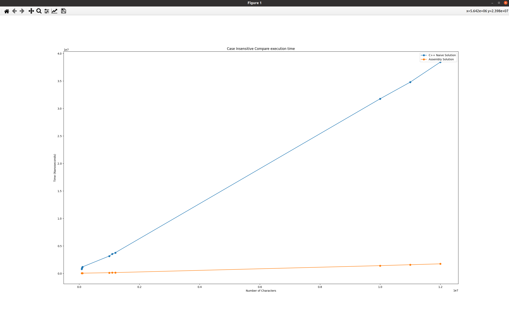
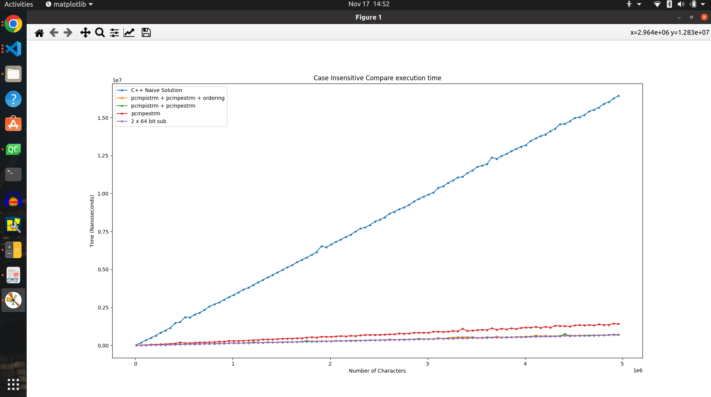
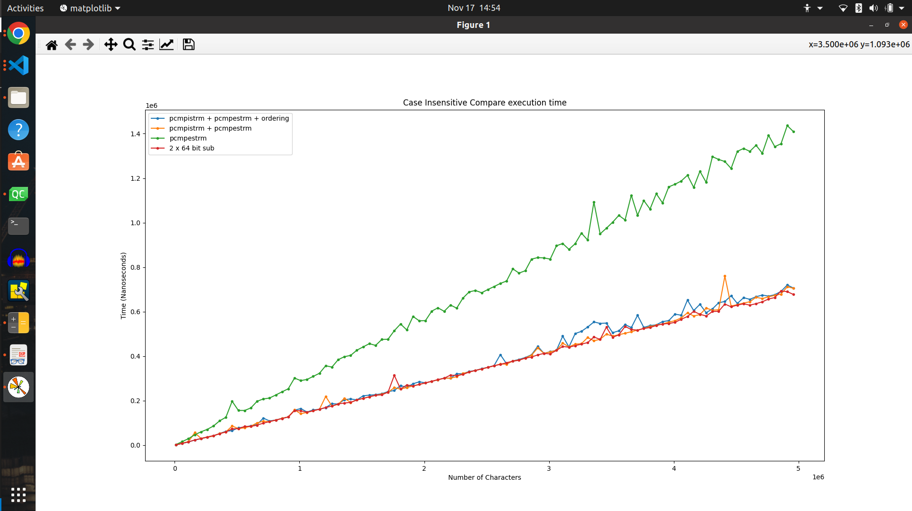
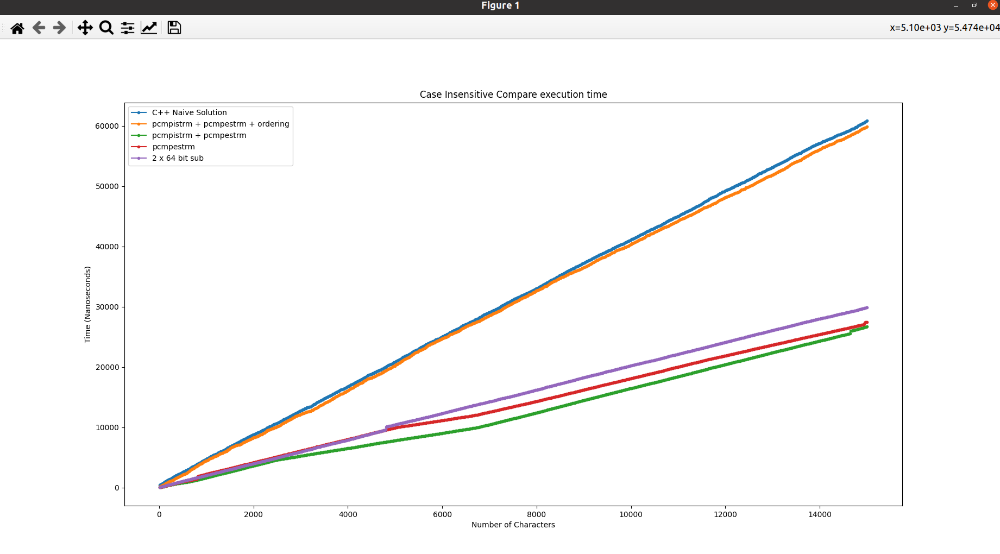

## Let's share some interesting facts what I tried in this project
---

 - ### How can we check if two strings are completely equal?
    - A naive implementation can be: 
    ```c++ 
    int compareCharByChar(char *str1, char* str2, int str1len, int str2len)
    {
        //not efficient implemnentation which is just a Naive solution

        for(int i=0; i<str1len; i++)
        {
            if(str1[i] != str2[i])
                return 1; //mismatch found
        }

        return 0; // no mismatch
    }
    ```

    - A optimization is possible implementing similar function in Assembly layer
    ```assembly
        .global compare_string                          # parameters are in *str1 = rax,  *str2 = rsi, str1len = rcx, str2len = rdx
        .text
        compare_string:

        loop_label:
            cmp         $0x00,      %rcx                # check if all characters are compared
            je          return_match                    # ensures that all characters were matched
            sub         $16,         %rcx                # substruct by 8
            movdqu      (%rax),     %xmm10              # move first 64 bit of str1 to xmm10 register(SSE)
            movdqu      (%rsi),     %xmm11              # move first 64 bit of str2 to xmm11 register(SSE)
            add         $16,         %rax                # skip the pointer by 8 bytes
            add         $16,         %rsi                # skip the pointer by 8 bytes
            pcmpistrm   $0x18,      %xmm10,     %xmm11  # compare two sse register completely equal or not
            movq        %xmm0,      %r8                 # move the result of xmm0 register to r8 register (temp) to perform cmp instruction
            cmp         $0x00,      %r8                 # check the output after pcmpistrm comparison
            je          loop_label
            jne         return_mismatch

        return_mismatch:
            movq        $0x01,      %rax
            ret

        return_match:
            movq        $0x00,      %rax
            ret
    ```

    - using c++ standard library
    ```c++
    int strcmp ( const char * str1, const char * str2 );
    ```
 - Here given the execution time (in Nanoseconds) among those 3 approaches:
    | Number of Characters  | Naive Approach | Assembly implementation | Assembly (Inline)    | C++ Standard Library |
    | --------------------- | -------------- | ----------------------- | -------------------- | -------------------- |
    | 8 * 10000             | 459247         | 14613                   | 14032                | 5130                 |
    | 8 * 100000            | 3807261        | 143541                  | 141726               | 97937                |
    | 8 * 1000000           | 13491303       | 616371                  | 616164               | 565875               |

 - ### How can we check if two strings are identical? (basically case insensitive compare)
    - A naive implementation can be:
    ```c++
    unsigned int compareCharByCharCaseInsensitive(unsigned char *str1, unsigned char* str2, unsigned int len)
    {
        int i=0, j=0;
        while(len)
        {
            int diff = tolower(str1[i]) - tolower(str2[i]);
            if(diff != 0)
                return diff; //mismatch found
            i++;
            j++;
            len--;
        }

        return 0; // no mismatch
    }
    ```
    - Or, we can make things faster using the help of SSE registers and check 16 characters parallelly. [N.B. It's a complete and working implementation]
    ```assembly
        ///< Assembly Implementation with SSE instructions
        int result;

        ASM(    ///< Prepare constant CHARACTER_RANGE
                movq        $0x5A41,        %%r12;                  // A: 0x41, Z: 0x5A --> defining Range
                movq        %%r12,          %%xmm12;                // CHARACTER_RANGE: xmm12, move quad word(64 bit) r12 to xmm12 to perform SSE instructions

                ///< Prepare constant CHARACTER_DIFF
                movq        $0x20202020,    %%r12;                  // Diff = 'a' - 'A' = 32 = x020, Prepare a doubleword value
                movq        %%r12,          %%xmm13;                // moving diff to SSE register
                pshufd      $0,             %%xmm13,    %%xmm13;    // CHARACTER_DIFF: xmm13, double word (32 bit) will be broadcasts to 128 bit like 0x20202020 20202020 20202020 20202020

            head_loop:
                cmp         $16,            %3;                     // check if all characters are compared
                jl          tail_loop;                              // all characters were matched so far. i.e. len = 37, 32 bytes are checked inside head_loop, 5 bytes will be checked inside tail_loop
                sub         $16,            %3;                     // substruct len 16, meaning 16 bytes are going to be checked inside this head_loop
                movdqu      (%1),           %%xmm10;                // move double quad word (128 bit) of lhs to xmm10 register(SSE)
                movdqu      (%2),           %%xmm11;                // move double quad word (128 bit) of rhs to xmm11 register(SSE)
                add         $16,            %1;                     // skip the pointer by 16 bytes
                add         $16,            %2;                     // skip the pointer by 16 bytes

                ///< Converting lhs to Lower
                pcmpistrm   $0x44,          %%xmm10,    %%xmm12;    // MASK: Compare characters is in range A <= c <= Z and store result bytes in xmm0
                pand        %%xmm13,        %%xmm0;                 // TO_ADD: CHARACTER_DIFF & MASK
                movdqu      %%xmm10,        %%xmm14;                // COPY: xmm10 --> xmm14
                paddb       %%xmm0,         %%xmm14;                // LOWER: TO_ADD + COPY --> xmm14

                ///< Converting rhs to Lower
                pcmpistrm   $0x44,          %%xmm11,    %%xmm12;    // MASK: Compare characters is in range A <= c <= Z and store result bytes in xmm0
                pand        %%xmm13,        %%xmm0;                 // TO_ADD: CHARACTER_DIFF & MASK
                movdqu      %%xmm11,        %%xmm15;                // COPY: xmm11 --> xmm15
                paddb       %%xmm0,         %%xmm15;                // LOWER: TO_ADD + COPY --> xmm15


                ///< Check lhs and rhs are identical or not
                pcmpistrm   $0x18,          %%xmm14,    %%xmm15;    // compare two sse register completely equal or not
                movq        %%xmm0,         %%r8;                   // move the result of xmm0 register to r8 register (temp) to perform cmp instruction
                cmp         $0x00,          %%r8;                   // check the output after pcmpistrm compare
                je          head_loop;
                jne         prepare_intermediate_mismatch;          // Here we already found a mismatch inside head_loop, need to check one by one again to return the result


            prepare_intermediate_mismatch:
                sub         $16,            %1;
                sub         $16,            %2;
                add         $16,            %3;
                jmp tail_loop;

            tail_loop:
                cmp         $0,             %3;
                je return_result_match;
                movq        (%1),           %%r13;
                movq        (%2),           %%r14;
                sub         $1,             %3;
                add         $1,             %1;
                add         $1,             %2;

                ///< convert single byte from str1 to lower
            str1:
                cmp         $0x41,          %%r13b;
                jl str2;
                cmp         $0x5A,          %%r13b;
                jg str2;
                add         $32,            %%r13b;

                ///< convert single byte from str2 to lower
            str2:
                cmp         $0x41,          %%r14b;
                jl compare;
                cmp         $0x5A,          %%r14b;
                jg compare;
                add         $32,            %%r14b;

            compare:
                sub         %%r14b,         %%r13b;
                cmp         $0,             %%r13b;
                jne return_result_mismatch;
                je tail_loop;

            return_result_mismatch:
                and         $0xFF,          %%r13;
                movl        %%r13d,         %0;
                jmp end_func;

            return_result_match:
                movl        $0,             %0;
            end_func:
            )
            : ///< output operands
                "=r" (result)                                       // %0
            : ///< input operands
                "r" (lhs),                                          // %1
                "r" (rhs),                                          // %2
                "r" (len)                                           // %3
            : ///< clobber
                "%xmm0", "%xmm10", "%xmm11", "%xmm12", "%xmm13","%xmm14", "%xmm15", "%r8", "%r12", "%r14", "%r13", "memory"

        );
        ///< Signed byte Value Range: -128...0....+127, following statement is going to convert unsigned value to signed value
        return result > 127 ? result - 256 : result;
    ```

 - Let's try to convert whole string to Lower case characters using SSE Instruction. It's a demonstration how we can convert 16 bytes characters to lower parallely.  
    | Field                 | 00    | 01    | 02    | 03    | 04    | 05    | 06    | 07    | 08    | 09    | 10    | 11    | 12    | 13    | 14    | 15    |
    | ---                   | --    | --    | --    | --    | --    | --    | --    | --    | --    | --    | --    | --    | --    | --    | --    | --    |
    | Input                 | O     | n     | c     | e     |       | U     | p     | o     | N     |       | A     |       | T     | i     | m     | e     |
    |  >=A                  | 0xFF  | 0xFF  | 0xFF  | 0xFF  | 0x00  | 0xFF  | 0xFF  | 0xFF  | 0xFF  | 0x00  | 0xFF  | 0x00  | 0xFF  | 0xFF  | 0xFF  | 0xFF  |
    |  <=Z                  | 0xFF  | 0x00  | 0x00  | 0x00  | 0xFF  | 0xFF  | 0x00  | 0x00  | 0xFF  | 0xFF  | 0xFF  | 0xFF  | 0xFF  | 0x00  | 0x00  | 0x00  |
    | mask: >=A && <=Z      | 0xFF  | 0x00  | 0x00  | 0x00  | 0x00  | 0xFF  | 0x00  | 0x00  | 0xFF  | 0x00  | 0xFF  | 0x00  | 0xFF  | 0x00  | 0x00  | 0x00  |
    | diff: 'a' - 'A'       | 0x20  | 0x20  | 0x20  | 0x20  | 0x20  | 0x20  | 0x20  | 0x20  | 0x20  | 0x20  | 0x20  | 0x20  | 0x20  | 0x20  | 0x20  | 0x20  |
    | toAdd: mask & diff    | 0x20  | 0x00  | 0x00  | 0x00  | 0x00  | 0x20  | 0x00  | 0x00  | 0x20  | 0x00  | 0x20  | 0x00  | 0x20  | 0x00  | 0x00  | 0x00  |
    | Output: Input + toAdd | o     | n     | c     | e     |       | u     | p     | o     | n     |       | a     |       | t     | i     | m     | e     |

- Here given the execution time (in Nanoseconds) C++ vs Assembly:
 [click here to view data](table_paragraph_test(28-Oct-2022).md)

  
- Here showing the graph using Naive and pcmpistrm + pcmpestrm + ordering (Time: 28 October, 2022)



- Here given the execution time (in Nanoseconds) among different assembly approaches:
 [click here to view data](table_paragraph_test(17-11-2022).md)

- Here showing the graph with all approaches (Time: 17 November, 2022, 15:03)



- Here showing the graph with all approaches except Naive Solution (Time: 17 November, 2022, 15:03)



- Now Check only 15 byte string, all execution times are cumulative sum:
[click here to view data](table_16_byte_test(17_11_2022).md)
 
- Here showing the graph with all approaches only for 15 bytes of character also randomly changed a byte to force mismatch (Time: 18 November, 2022, 12:58)


- After removing superfluous operation (extra sub operation just to check ZFlag) 16 byte test (21-11-2022):
[click here to view data](table_16_byte_test(21-11-2022).md)
.png)


- After removing superfluous operation (extra sub operation just to check ZFlag) 64 byte test (21-11-2022):
[click here to view data](table_64_byte_test(21-11-2022).md)
.png)

- 1 to 64 bytes test with all approach (23-Nov-2022):
[click here to view data](table_1_to_64_bytes_test(23-Nov-2022).md)
.png)

- 1 to 64 bytes test (Cummulative Sum)with all approach (23-Nov-2022):
[click here to view data](table_1_to_64_bytes_test_Cumulative(23-Nov-2022).md)
.png)